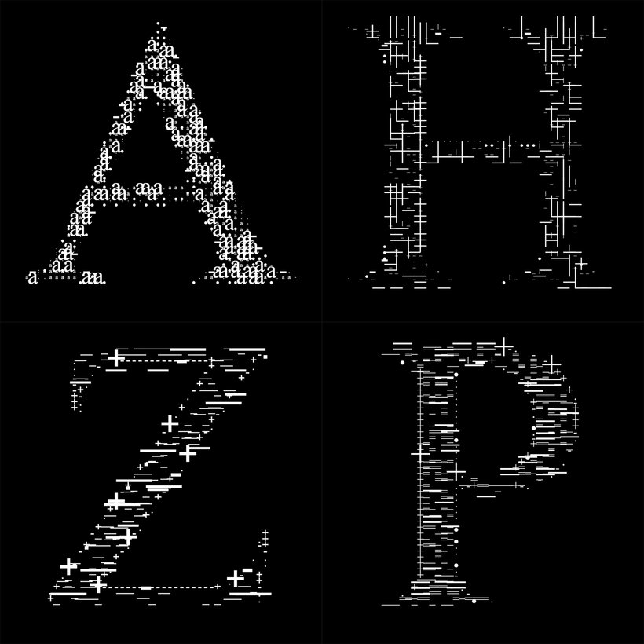

# Sketch-text

In ```sketch-text.js``` I learnt to work with text, asynchronous functions (to listen to keyboard events), how to read color values from the pixels of the canvas and how to draw a big glyph formed out of small ones.

